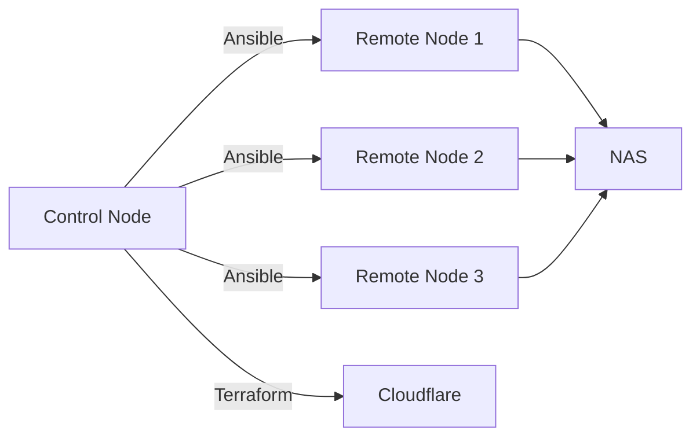

import { Callout, Steps, Step } from "nextra-theme-docs";

# Automated Homelab Deployment with Ansible and Terraform

The main goal of this project is to provide a structured and automated approach to deploying and managing a homelab environment. By leveraging infrastructure as code (IaC), we can create and restore critical parts of our homelab with just a command. Better yet, we can version control much of the homelab itself. 

To automate our homelab deployment, we'll:

* Set up Ubuntu Server LTS on mini-pcs using auto-configurations. 
* Utilize Ansible to manage server states and perform nightly backups
* Use Terraform to connect Docker containers to publicly accessible domain names (e.g., yourhomelab.com)

While this project was originally for my personal homelab, you might find some use from this if you:

* Don't want to set up your homelab (e.g. servers, software, dns, etc) manually each time
* You had your entire homelab get deleted and feel bad about it so you tell yourself you'll automate it but then it takes forever to remember all things you did to create your server in the first place but after a while you finally get something working
* Are interesting in learning more about idempotency, IaC, etc

## High-level Architecture

Here's a high-level overview of the architecture:

The architecture consists of the following components:

- **Control Node**: The central machine that orchestrates the deployment and management of the homelab infrastructure using Ansible and Terraform. For example, your laptop or desktop pc. **Note that you cannot use Windows as your control node.**
- **Remote Nodes**: The individual servers or mini-PCs (e.g., Intel NUCs) that host various services and applications in the homelab. Each remote node should have a matching git repository where you store your docker configs. For example, one node that handles home automation, document tracking and photo sharing for my family. Another node that serves as a media and game server. This project does _not_ clone the same remote node and load balacing them.
- **NAS**: Network Attached Storage that provides shared storage for the remote nodes.
- **Cloudflare**: A cloud-based platform used for DNS management and secure remote access to homelab services.

## Benefits of Automation

Automating the deployment and management of your homelab offers several key benefits:

- **Consistency**: Ensure that all remote nodes are configured identically and adhere to a defined set of standards.
- **Repeatability**: Easily reproduce the entire homelab setup or specific components with minimal effort.
- **Scalability**: Quickly add or remove remote nodes and services as your homelab grows or evolves.
- **Time-saving**: Automate tedious and repetitive tasks, allowing you to focus on more important aspects of your homelab.
- **Version Control**: Keep track of configuration changes and easily rollback if needed using version control systems like Git.

<Callout type="info">
Before diving into the deployment process, make sure you have a basic understanding of Ansible, Terraform, and the technologies used in this project. Familiarity with Linux, networking, and containerization (Docker) will also be beneficial.
</Callout>

In the following sections, we will guide you through the process of setting up the control node, configuring Ansible and Terraform, deploying remote nodes, and managing DNS with Cloudflare. By the end of this documentation, you'll have a fully automated and manageable homelab infrastructure.

Let's get started with [Setting up the Control Node](/control-node-setup)!
